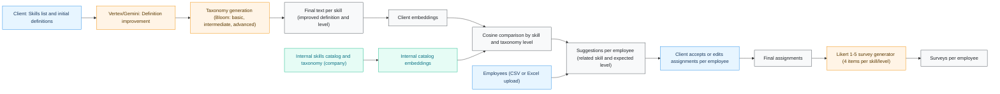

```mermaid

%%{init: {'flowchart': { 'htmlLabels': false, 'wrap': true }}}%%
flowchart LR
    %% Inputs
    A1["Client: Skills list and initial definitions"]
    A2["Employees (CSV or Excel upload)"]
    A3["Internal skills catalog and taxonomy (company)"]

    %% Step 1: Enrichment
    B1["Vertex/Gemini: Definition improvement"]
    B2["Taxonomy generation (Bloom: basic, intermediate, advanced)"]

    %% Step 2: Client embeddings
    C1["Final text per skill (improved definition and level)"]
    C2["Client embeddings"]

    %% Step 3: Matching with catalog
    D1["Internal catalog embeddings"]
    D2["Cosine comparison by skill and taxonomy level"]
    D3["Suggestions per employee (related skill and expected level)"]

    %% Step 4: Client curation
    E1["Client accepts or edits assignments per employee"]
    E2["Final assignments"]

    %% Step 5: Surveys
    F1["Likert 1-5 survey generator (4 items per skill/level)"]
    F2["Surveys per employee"]

    %% Flow
    A1 --> B1 --> B2 --> C1 --> C2
    A3 --> D1
    C2 --> D2
    D1 --> D2 --> D3
    A2 --> D3
    D3 --> E1 --> E2 --> F1 --> F2

    %% Styles
    classDef cli fill:#e7f5ff,stroke:#228be6,color:#1c3a5e
    classDef ai  fill:#fff4e6,stroke:#f08c00,color:#5b3a00
    classDef sys fill:#f8f9fa,stroke:#495057,color:#212529
    classDef int fill:#e6fcf5,stroke:#12b886,color:#0b7285

    %% Class assignment (compatible mode)
    class A1,A2,E1 cli;
    class B1,B2,F1 ai;
    class C1,C2,D2,D3,E2,F2 sys;
    class A3,D1 int;


```
